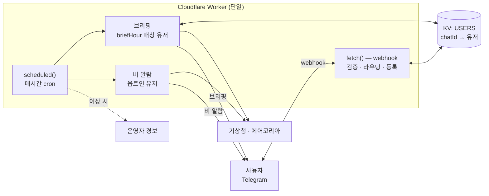

# 🌅 전국 아침 브리핑 봇

전국 시·군·구의 아침 날씨를 매일 원하는 시각에 텔레그램으로 보내주는 서버리스 봇.
비·기온·체감온도·미세먼지·옷차림을 한 메시지로 받고, 곧 비가 오면 실시간 알림도 받는다(옵트인).
[Cloudflare Workers](https://workers.cloudflare.com)와 KV로 돌아가 서버도 DB도 없이 운영한다.


> 라이브: **[@korea_weather_briefing_bot](https://t.me/korea_weather_briefing_bot)** — `/start` 한 번이면 끝.

```
🌅 6월 15일 강남구 아침 브리핑

☔ 오늘 비 소식 있어요! (14시~18시, 강수확률 최대 80%) 우산 꼭 챙기세요!
🌡 최저 19°C / 최고 32°C (체감 18~35°C)
⏰ 시간대별
06시  19°  ☀️ 맑음
09시  23°  ⛅ 구름많음
12시  28°  ☁️ 흐림
15시  32°  🌧 비
18시  27°  🌦 소나기
21시  22°  ☀️ 맑음
👕 옷차림: 맨투맨·얇은 니트·가디건 ~ 민소매·반팔·반바지

미세먼지(PM10): 45㎍/㎥ · 보통 🔵
초미세먼지(PM2.5): 22㎍/㎥ · 보통 🔵

🎨 오늘의 행운 색: 청록 🩵

좋은 하루 보내세요! 💪
```

비가 다가오면 이런 실시간 알람이 따로 온다(초단기예보 기반).

```
☔ 강남구 13시~15시 강한 비 예상
우산 챙기세요! ☂️
```

## 기능

- 매일 원하는 시각(05~10시)에 아침 브리핑 — 비 소식, 최저/최고·체감온도, 시간대별 날씨, 옷차림, 미세먼지
- 지역 최대 2개 등록
- 실시간 비 알람(옵트인) — 1시간 내 강수가 예상되면 시작~종료 시각과 강도를 미리 알림
- 등록부터 발송까지 모두 서버리스, 무료 한도 안에서 동작

## 사용 방법

운영 중인 봇이라 설치할 게 없다.

1. 텔레그램에서 [@korea_weather_briefing_bot](https://t.me/korea_weather_briefing_bot) 검색
2. `/start` → 버튼으로 시/도 → 시/군/구 → 받는 시각(05~10시) 선택
3. 다음 날 고른 시각부터 매일 브리핑이 온다 (시각을 안 고르면 7시)
4. `/region`에서 지역 추가(최대 2개)·받는 시각 변경·실시간 비 알람을 켤 수 있다

| 명령어 | 기능 |
|--------|------|
| `/start` | 알림 시작 / 지역 선택 |
| `/region` | 설정 — 지역 추가·변경·삭제, 받는 시각, 비 알람 |
| `/rainalert` | 실시간 비 알람 켜기·끄기 |
| `/stop` | 알림 해지 |

## 기술 스택

| 영역 | 사용 기술 |
|------|-----------|
| 런타임 | Cloudflare Workers (서버리스, 엣지) |
| 언어 | TypeScript (런타임 외부 의존성 0) |
| 상태 저장 | Cloudflare KV |
| 스케줄 | Workers Cron Triggers |
| 메시징 | Telegram Bot API (Webhook) |
| 외부 데이터 | 기상청 단기/초단기예보 · 에어코리아 대기오염 (공공데이터포털) |
| 테스트 | Vitest (TDD) |
| 데이터 생성 | Python (기상청 LCC 좌표 변환) |

## 아키텍처

단일 Worker가 두 진입점을 맡는다. `fetch`는 webhook으로 등록·변경·해지를 즉시 처리하고, `scheduled`는 매시간 cron으로 그 시각을 받는 시각으로 고른 유저에게 브리핑을 보내고 옵트인 유저에게 비 알람을 보낸다. 상태는 KV 한 곳에 유저당 키 1개로 저장한다.



받는 시각을 유저가 나눠 고르게 한 게 핵심이다. 한 실행당 50개인 subrequest 한도를 시각별로 분산해 cron을 늘리지 않고 수용 인원을 늘렸다(아래 의사결정 3번).

<details>
<summary><b>기술적 의사결정 — 무엇을 고민했고 왜 이렇게 했나</b></summary>

### 1. 폴링 → Webhook
초기엔 GitHub Actions cron으로 `getUpdates`를 폴링했는데, 무료 러너 특성상 `/start` 응답이 수 분씩 밀렸다. Telegram Webhook으로 바꿔 즉시 처리하고, 상시 HTTPS 엔드포인트가 필요한 문제는 서버리스(Workers)로 풀었다.

### 2. 상태 저장: `state.json` → KV
유저 목록을 public 레포의 `state.json`에 커밋하던 방식은 chat_id가 그대로 노출되고 동시 커밋이 충돌했다. Cloudflare KV로 옮기고 유저당 키 1개(`chatId`) 스키마로 노출과 경합을 함께 없앴다.

### 3. 무료 한도 설계 (한 실행당 subrequest 50개)
브리핑은 유저마다 외부 호출(날씨·미세먼지·발송)을 해서 인원이 늘면 한도를 넘는다. 네 가지로 대응했다.
- **캐싱**: 날씨는 격자(nx, ny)별, 미세먼지는 시·도별로 묶어 호출을 줄임
- **예산 가드**: 카운터가 45에 닿기 전 멈추고 남은 대상을 로그로 남겨 조용한 실패를 막음
- **날짜 회전**: 한도에 걸려도 매일 같은 사람이 밀리지 않게 처리 순서를 날짜로 회전
- **시각 분산**: 받는 시각(05~10시)을 유저가 고르면 시각별로 cron 실행이 갈려 각자 50 예산을 새로 받음 — cron을 늘리지 않고 수용 인원을 늘린 핵심 트릭

### 4. 보안 (공개 레포 + 공개 엔드포인트 전제)
- `setWebhook`의 `secret_token`을 헤더로 검증해 위조 요청은 403
- 처리 중 예외가 나도 텔레그램엔 200을 반환해 무한 재시도를 막음
- 봇 토큰·API 키는 `wrangler secret`에만 두고 레포엔 커밋하지 않음(`.dev.vars`는 `.gitignore`)
- 배포 Worker는 런타임 의존성이 없어(`dependencies: {}`) 공격 표면이 작음

### 5. 데이터: 격자 좌표·미세먼지·시간 처리
- 기상청 단기예보는 위경도가 아닌 자체 격자(nx, ny)를 쓴다. 시군구 중심 좌표를 LCC 투영 공식으로 변환하는 스크립트(`tools/build_regions.py`)로 전국 격자를 만들고 빌드 때 검증했다(시·도 수, 좌표 범위 등).
- 에어코리아 측정소명이 시군구명과 늘 일치하진 않는다. 일치하는 측정소가 있으면 실측값을, 없으면 시·도 평균을 쓰고 메시지에 `(○○ 평균)`이라고 밝힌다.
- Workers는 UTC로 도니 KST 변환 후 발표 시각 기준으로 base_time을 계산하고, 콜백 데이터 64바이트 제한 때문에 한글 대신 인덱스(`s:{slot}:{i}`)로 인코딩한다.

### 6. 실시간 비 알람
초단기예보(`getUltraSrtFcst`)로 1시간 내 강수를 본다. 2시간까지 보면 빗나가는 예보가 많아 좁혔고, 종일 계획은 아침 브리핑이 맡는다. 옵트인 유저만 점검하며, 같은 비를 반복해 보내지 않도록 비의 종료 시각을 KV에 기록해 끝난 뒤 오는 새 비만 다시 알린다. 새벽(23~06시)엔 보내지 않는다. 문구는 강수확률 % 대신 시작~종료 시각과 강도(약/강), 행동 한 줄로 구성했다. 받는 시각·정원·룩어헤드 같은 값은 여러 사용자 상황을 가정해 정했다.

### 7. 운영 관측가능성 (dead-man switch)
서버리스 cron은 조용히 실패한다(키 만료·기상청 장애). 그래서 실행이 끝날 때 대상이 있는데 전송이 0건이거나 발송·조회 실패가 생기면 `ADMIN_CHAT_ID`로 경보를 한 건 보낸다. 미설정이면 비활성.

### 8. 데이터 모델 진화 (무중단 마이그레이션)
지역 2개와 받는 시각을 더하며 `User` 스키마가 단일 지역에서 `regions[]`로 바뀌었다. 일괄 마이그레이션 대신 읽는 시점에 옛 스키마를 변환(`normalizeUser`)해 기존 유저를 끊지 않고 넘어갔다.

</details>

## 테스트

- TDD로 작성, Vitest 단위 테스트 109개 (`cd worker && npm test`).
- 핵심 로직 위주로 검증한다: 키보드/콜백 라운드트립, KV 저장소(in-memory mock)와 레거시 스키마 변환, 미세먼지 fallback, 메시지 빌드(체감온도·시간대별), 비 알람(초단기 파싱·강수 구간·에피소드 중복방지), 받는 시각 정원, subrequest 예산·날짜 회전, cron 라우팅·운영 경보, webhook secret 검증.
- 타입 게이트: `npx tsc --noEmit` (프로덕션 `src`, strict).
- 모듈은 단일 책임으로 나누고(`regions`·`store`·`telegram`·`register`·`briefing`·`rainalert`·`index`) 의존성을 주입해 테스트했다.

## 프로젝트 구조

| 파일 | 역할 |
|------|------|
| `worker/src/index.ts` | 진입점 — `fetch`(webhook) + `scheduled`(매시간 cron) + 운영 경보 |
| `worker/src/register.ts` | 등록·변경·해지(지역 2개) + 설정 메뉴 + 받는 시각·비 알람 |
| `worker/src/briefing.ts` | 지역별 날씨/미세먼지 브리핑 + 체감온도 + 예산·회전 |
| `worker/src/rainalert.ts` | 초단기예보 기반 실시간 비 알람 |
| `worker/src/regions.ts` | `regions.json` 로드 + 인라인 키보드 + 콜백 해석 |
| `worker/src/store.ts` | KV 유저 저장소 (유저당 키 1개, 레거시 스키마 변환) |
| `worker/src/telegram.ts` | 텔레그램 Bot API 헬퍼 |
| `worker/wrangler.toml` | Worker 설정 (KV 바인딩, 매시간 cron) |
| `regions.json` · `tools/build_regions.py` | 전국 시군구 격자 좌표 + 생성·검증 도구 |

## 직접 운영하기

MIT 라이선스. 직접 띄우려면 Cloudflare 무료 계정, 텔레그램, 공공데이터포털 계정이 필요하다.

<details>
<summary>배포 가이드</summary>

### 1. 공공데이터포털 API 키
1. [data.go.kr](https://www.data.go.kr) 가입 → `기상청_단기예보 조회서비스`, `에어코리아 대기오염정보`를 각각 활용신청(자동승인)
2. 일반 인증키(Decoding)를 복사한다 — Encoding 아님. 계정당 1개라 두 API가 공용으로 쓰고, 단기/초단기예보는 같은 서비스라 추가 신청이 필요 없다.

### 2. 텔레그램 봇
1. [@BotFather](https://t.me/BotFather) → `/newbot` → 토큰 복사
2. `/setcommands`로 `start`·`region`·`rainalert`·`stop` 등록(선택)

### 3. Cloudflare Workers 배포
```bash
npm i -g wrangler && wrangler login
cd worker && npm install

wrangler kv namespace create USERS    # 출력 id를 wrangler.toml에 기입
wrangler secret put TELEGRAM_BOT_TOKEN
wrangler secret put DATA_GO_KR_KEY
wrangler secret put WEBHOOK_SECRET     # 임의 난수 (예: openssl rand -hex 16)
wrangler secret put ADMIN_CHAT_ID      # 선택 — cron 이상 시 경보 받을 본인 chatId
wrangler deploy
```

### 4. Webhook 등록
```bash
curl "https://api.telegram.org/bot<토큰>/setWebhook" \
  -d "url=<WorkerURL>" -d "secret_token=<WEBHOOK_SECRET와 동일>"
```
텔레그램에서 `/start`로 즉시 응답을 확인한다. 로그는 `wrangler tail`.

### 운영 메모
- 발송 시각은 유저가 `/region`에서 고른다. cron은 `0 * * * *` 하나이고, "현재 KST 시각 == 유저 `briefHour`"인 사람에게 브리핑한다. 선택 시각 폭·정원은 `register.ts`의 `BRIEF_HOURS`·`BRIEF_SLOT_CAP`로 조정한다.
- 비 알람의 룩어헤드·침묵 시간·강도 임계값은 `rainalert.ts` 상단 상수로 조정한다.
- 무료 한도가 부족하면 유료 플랜($5/월)이나 Cloudflare Queues로 확장한다.
- 지역 데이터 갱신: `python tools/build_regions.py`로 `regions.json`을 재생성한 뒤 `worker/regions.json`에 복사.

</details>

## License

[MIT](LICENSE)
